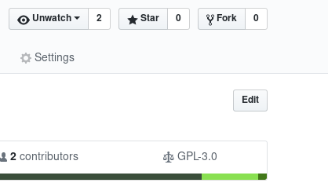
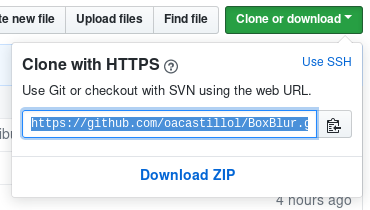

# Como contribuir a este repositorio

## Para contribuir al código 
A continuación se enumeran los pasos que se deben seguir para ayudar a mejorar el código

1. Se debe entrar con su cuenta de [github](https://github.com) al repositorio del [proyecto](https://github.com/oacastillol/BoxBlur) use el botón fork, esto creara una copia del repositorio en su cuenta, donde podrá realizar sus modificaciones.


   
   
2. Luego clone su repositorio, lo puede encontrar al ingresar a ```https://github.com/<USERNAME>/BoxBlur``` donde ```<USERNAME>``` es su nombre de usuario. Desde su terminal ejecute ```git clone <URL>``` donde ```<URL>``` es la que aparece en el botón Clone or download. Esto descargara una copia a su computador del repositorio.





3. Realice sus cambios de manera local, por favor mantenga los nombres a menos que sea un nuevo recurso. Se usa un tabulador que equivale a 4 espacios, para la edición le recomendamos usar emacs o vim ambos editores soportan muy bien los archivos contenidos en el repositorio. Le recomendamos usar comentarios

4. Luego debe crear una nueva rama en su repositorio para esto use el siguiente comando ```git checkout -b <nombreRama>``` asocie el nombreRama con el mayor cambio o funcionalidad realizada.

5. Posteriormente agregue los archivos cambiados al seguimiento de git mediante el comando ```git add --all``` para confirmar que se agregaron los archivos correctamente use ```git status``` este le mostrara con detalle la información actual de su repositorio; posteriormente realice un commit ```git commit -m "<Mensaje>"``` busque que el ```<Mensaje>``` sea lo más descriptibles posibles.

6. Luego debe subir estos cambios a internet para esto usaremos el comando ```git push --set-upstream origin <nombreRama>``` esto agregara la nueva rama y sus cambios al repositorio que puede ver en [github](https://github.com)

7. Finalmente diríjase a la pestaña Pull request allí seleccione el botón New Pull request, esto generara la solicitud que sera evaluada para agregar sus contribuciones al repositorio.

## El algoritmo

Nos basamos en las siguientes fuentes:
* <http://amritamaz.net/blog/understanding-box-blur>
* <https://web.archive.org/web/20060718054020/http://www.acm.uiuc.edu/siggraph/workshops/wjarosz_convolution_2001.pdf>
* <https://www.w3.org/TR/SVG11/filters.html#feGaussianBlurElement>

Gracias por tu interés en contribuir al proyecto
